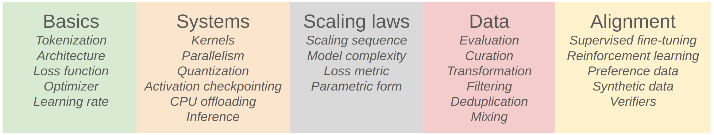
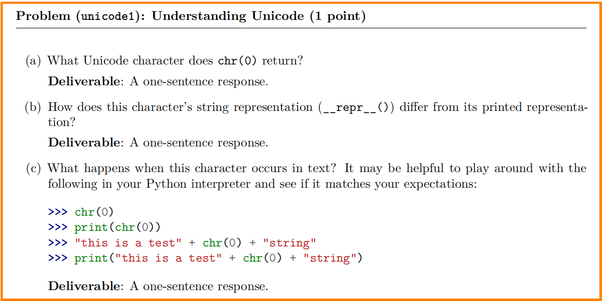
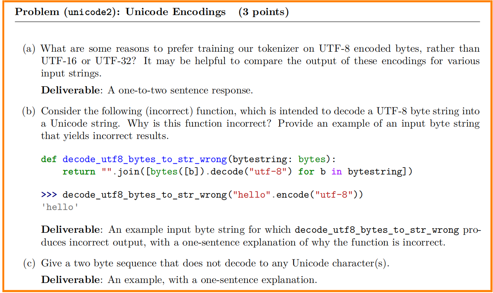
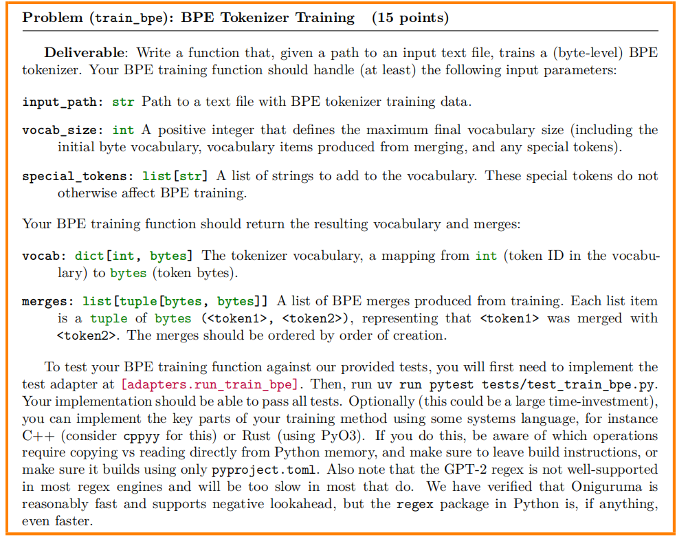
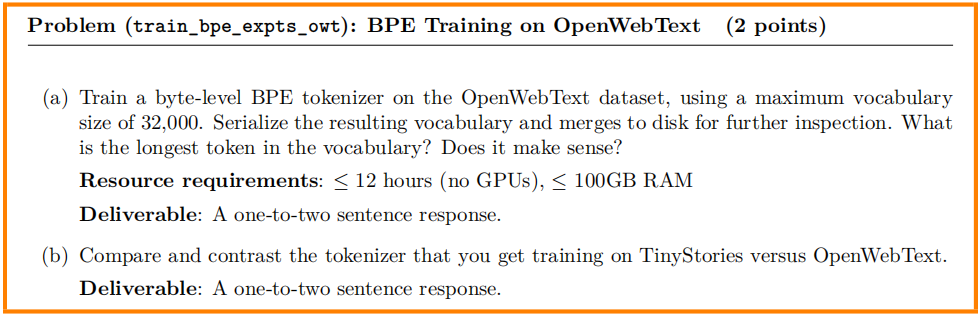
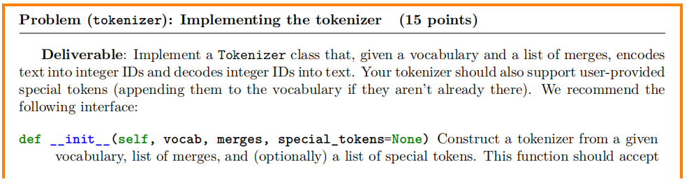
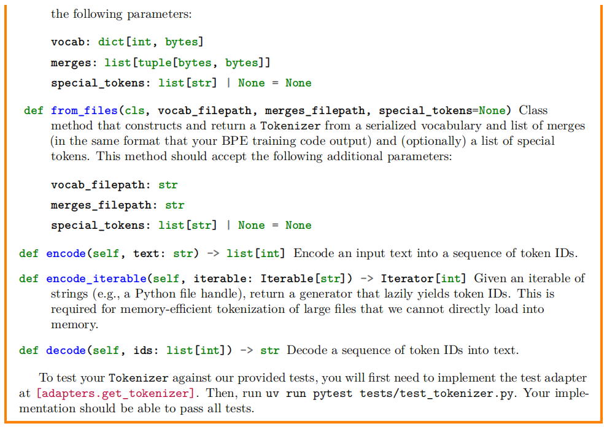

# Lecture 1

## Simple Instruction

* **Mindset**: squeezing the most out of the hardware, taking scale seriously (scaling laws)
* **Intuitions**: which data and modeling decisions yield good accuracy
* **Mechanics**: how things work (what a Transformer is, how model parallelism leverages GPUs)

**Design decisions:**

* Data processing: avoid wasting precious compute updating on bad / irrelevant data
* Tokenization: working with raw bytes is elegant, but compute-inefficient with today's model architectures.
* Model architecture: many changes motivated by reducing memory or FLOPs (e.g., sharing KV caches, sliding window attention)
* Training: we can get away with a single epoch!
* Scaling laws: use less compute on smaller models to do hyperparameter tuning
* Alignment: if tune model more to desired use cases, require smaller base models

## BPE tokenizer

​	将任意（Unicode）**字符串**表示为一个字节序列，并在这个字节序列上训练我们的BPE分词器。之后，将使用这个分词器将文本（字符串）编码为词元（一个整数序列），用于语言建模。

|       分词方式        |                             优点                             |                  缺点                  |                        适用场景                        |
| :-------------------: | :----------------------------------------------------------: | :------------------------------------: | :----------------------------------------------------: |
|        字符级         |                  适用所有语言；无 OOV 问题                   |      序列长，计算量大；语义信息弱      |           中文、日文等无空格语言；字符级任务           |
|         词级          |                     序列短；语义单位直观                     | OOV 严重；词表需频繁更新；跨语言适配差 |                 空格分隔语言（英文等）                 |
| **子词级（Subword）** | **兼顾 OOV 处理与效率；词表可控；跨语言适用；常见词高效编码** |     对人类可读性稍差；依赖训练语料     | 现代 NLP 模型主流选择（BPE、WordPiece、SentencePiece） |

### Unicode编码

​	Unicode 是一种文本编码标准，它将字符映射到整数码位。使用 `ord()` 函数将单个 Unicode 字符转换为其整数表示。`chr()` 函数则将一个整数 Unicode 码位转换为相应字符的字符串。

​	Unicode 标准本身定义了三种编码：UTF-8、UTF-16 和 UTF-32，其中 UTF-8 是互联网的主流编码.在 Python 中将 Unicode 字符串编码为 UTF-8，可以使用 `encode()` 函数.使用 `decode()` 函数将 UTF-8 字节串解码回 Unicode 字符串。

### BPE tokenizer training procedure

BPE分词器训练过程包括三个主要步骤:

- **Vocabulary initialization**：生成一个字符串词元到整数ID一一对应的词汇表。
- **Pre-tokenization**：按照一定的规则对文本进行词元划分。
- **Compute BPE merges**：BPE算法迭代地计算每对字节的出现次数，并识别出频率最高的一对（“A”，“B”）。这个最频繁的对（“A”，“B”）的每次出现都会被合并，即替换为一个新的词元“AB”。这个新的合并词元被添加到我们的词汇表中。

> 主要思想是在源文本上**训练**编码器，使其自适应词表

### Special tokens

在编码文本时，通常希望将某些字符串视为“特殊词元”，这些词元永远不应被分割成多个词元。例如，序列结束字符串 `<|endoftext|>` 应该始终保留为单个词元（即单个整数ID），这样我们才能知道何时停止从语言模型生成文本。这些特殊词元必须被添加到词汇表中，以便它们有对应的固定词元ID。

## Assignment 1

[[GitHub\]](https://github.com/stanford-cs336/assignment1-basics)[[PDF\]](https://github.com/stanford-cs336/assignment1-basics/blob/main/cs336_spring2025_assignment1_basics.pdf)

- Implement **BPE tokenizer**

- Implement **Transformer**, **cross-entropy loss**, **AdamW optimizer**, **training loop**

- Train on **TinyStories** and **OpenWebText**

- Leaderboard: minimize **OpenWebText** perplexity given 90 minutes on a **H100** [[last year's leaderboard\]](https://github.com/stanford-cs336/spring2024-assignment1-basics-leaderboard)

### Problem 1



### Answer 1

- unicode码为0代表的是一个空字符'\x00',所以返回的也是一个空字符'\x00',打印输出不可见
- repr()会显示字符串的表示形式，包括任何不可打印字符的转义序列。repr(chr(0))会返回 `\\\x00'

- ```python
  Python 3.10.8 (tags/v3.10.8:aaaf517, Oct 11 2022, 16:50:30) [MSC v.1933 64 bit (AMD64)] on win32
  Type "help", "copyright", "credits" or "license" for more information.
  >>> chr(0)
  '\x00'
  >>> repr(chr(0))
  "'\\x00'"
  >>> print(chr(0))
  
  >>> "this is a test"+chr(0)+"string"
  'this is a test\x00string'
  >>> print("this is a test"+chr(0)+"string")
  this is a test string
  ```

### Problem 2



### Anwser 2

- UTF-8 对 ASCII 文本非常高效（英文等单字节编码），节省存储空间，兼容性更好
- `"é"` 在 UTF-8 中是 `b'\xc3\xa9'` 两字节，逐字节解码会得到 `'é'` 而不是 `'é'`。
  - 该函数逐字节单独解码，而 UTF-8 中很多字符是由多个字节组合表示的，逐字节解码会导致解码错误或报错。

- `b'\xc3\x28'`
  -  `\xc3` 在 UTF-8 中表示一个两字节字符的起始字节，后面必须跟随一个 `10xxxxxx` 形式的续字节，但 `\x28`（即 `'('`）不符合规则，因此无效。

### Problem 3/4



**Intput：**

- `input_path: str`：包含BPE分词器训练数据的文本文件路径。数据集是TinyStories。
- `vocab_size: int`：一个正整数，定义最终词汇表的最大大小（包括初始字节词汇表、合并产生的词汇表项和任何特殊词元）。
- `special_tokens: list[str]`：要添加到词汇表中的字符串列表。这些特殊词元不会以其他方式影响BPE训练。

**Output:**

- `vocab: dict[int, bytes]`：分词器词汇表，一个从 `int`（词汇表中的词元ID）到 `bytes`（词元字节）的映射。
- `merges: list[tuple[bytes, bytes]]`：从训练中产生的BPE合并列表。每个列表项是一个 `tuple` of `bytes` (`<token1>`, `<token2>`)，表示 `<token1>` 与 `<token2>` 合并。合并应按创建顺序列出。

**具体实现步骤：**首先需要实现`adapter.py`中位于 `adapters.run_train_bpe` 的测试适配器。然后，运行 `uv run pytest tests/test_train_bpe.py`来进行测试。

------

***要点:***

- ***并行化预分词***
- ***预分词前移除特殊词元***
- ***优化合并步骤***



构造词元划分类:


