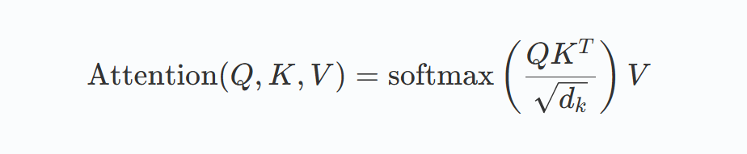
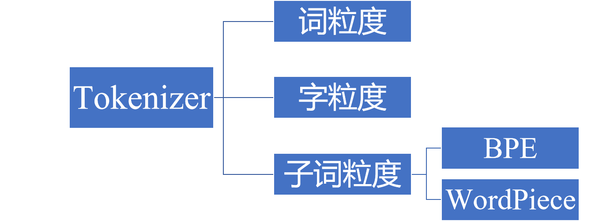
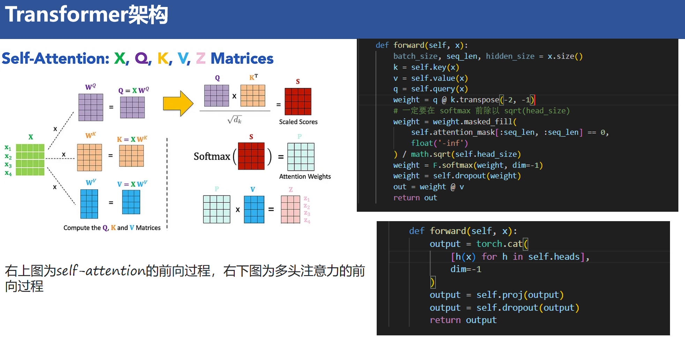
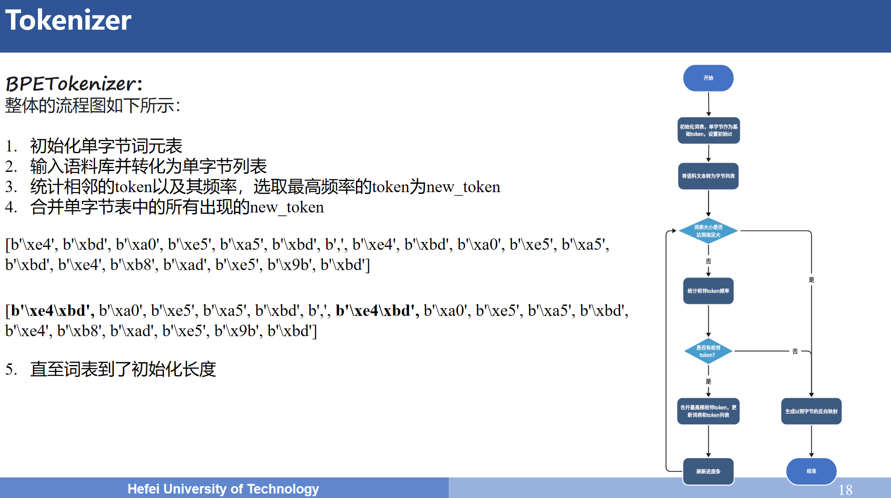
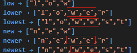

# Week1
## 什么是大模型
## NLP基础
### NLP 是⼀种让计算机理解、解释和⽣成⼈类语⾔的技术
#### NLP下游任务：包括但不限于中⽂分词、⼦词切分、词性标注、⽂本分类、实体识别、关系抽取、⽂本摘要、机器翻译以及⾃动问答系统的开发。

## 大模型的定义与特点
### 定义：⼤语⾔模型，是⼀种相较传统语⾔模型参数量更多、在更⼤规模语料上进⾏预训练的语⾔模型
### 核心特点：
| 特点        | 描述                                                        |
|-------------|------------------------------------------------------------|
| 参数规模庞大 | 例如GPT-3参数达1750亿，通过海量数据训练捕捉复杂的语言规律。     |
| 数据需求量大 | 训练数据通常涵盖互联网文本、书籍、代码等多源信息，规模可达TB级。 |
| 务泛化能力强 | 通过预训练学习通用知识，可适配翻译、问答、创作等多样化任务。     |

## 大模型训练的三个过程
### 预训练（Pretraining）→ 指令微调（Instruction Tuning）→ 对齐微调（Alignment Tuning）
| 训练过程  | 描述                                                                     |
|----------|--------------------------------------------------------------------------|
| 预训练    | 模型通过无监督学习从海量文本中学习语言模式。                                |
| 指令微调  | 引入有监督数据，教会模型理解人类指令。                                      |
| 对齐微调  | 通过人类反馈强化学习（RLHF）或直接偏好优化（DPO），让模型输出更符合人类价值观。 |

#### 大多数大语言模型以自回归方式运行，即根据前面的词元（或子词）序列预测下一个词元的概率分布。在文本生成过程中，模型通过解码算法确定下一个输出词元，可采用选择概率最高词元的贪心策略，或从预测的概率分布中随机采样。

## Transformer 架构
### Transformer 架构的关键是自注意力机制，与按顺序处理词元且难以处理长距离依赖的 RNN 不同，它能衡量每个词元相对于其他词元的重要性，使模型动态关注输入的相关部分
### 其数学公式如下：

#### Q､K､V分别是查询､键和值矩阵

### 计算原始关联分数即（Q Kᵀ）
#### 公式中的 Q Kᵀ（Q 乘以 K 的转置）是计算 “关联分数” 的核心步骤，Q 是 [seq_len, d_k]，Kᵀ是 [d_k, seq_len]，两者相乘后得到一个 [seq_len, seq_len] 的相似度分数矩阵

### 进行缩放（除以√d_k）
#### 除以√d_k 后，可将分数的方差控制在 1 附近，避免分数极端化，让 softmax 能更合理地分配注意力权重
##### 当 d_k（Q或者K 的维度）较大时，Q Kᵀ计算出的分数会被 “放大”（因为向量内积的结果会随维度增加而增大），这就导致如果输入分数差异过大，softmax 会将概率几乎全部集中在分数最大的元素上致使其他元素概率接近 0，最终模型 “过度关注个别词，忽略其他相关词”，失去注意力的灵活性。

### 进行归一化（softmax）
#### 对分数矩阵的每一行应用 softmax，使每一行的所有元素之和为 1，得到一个 [seq_len, seq_len] 的 注意力权重矩阵

### 加权求和（乘以 V）
#### 将注意力权重与语义内容（V）结合，注意力权重矩阵是 [seq_len, seq_len]，V 是 [seq_len, d_v]，两者相乘后得到 [seq_len, d_v] 的输出矩阵，至此每个词的特征不再是孤立的，而是融入了序列中其他相关词的信息

#### 可以结合这个动图了解一下具体的计算流程

#### 这里就不花篇幅介绍这个公式了，如果不理解的话这里放了 [The Illustrated Transformer的链接](https://jalammar.github.io/illustrated-transformer/)

## 关键组件
| 组件              | 描述 |
|------------------|-------|
| 多头注意力        | 将输入分割为多个子空间并行计算注意力，再将结果拼接 |
| 前馈网络和层归一化 | 每个 Transformer 层包含应用于每个词元的前馈网络（本质是 MLP），以及层归一化和残差连接，这些操作稳定训练过程并支持更深层次的架构，目前均方根归一化（RMSNorm）也被广泛使用，其与层归一化的主要区别是计算过程中仅计算平方均值 |
| 位置编码          | 由于 Transformer 本身不编码词元顺序，因此添加基于位置和频率的正弦函数作为位置编码来表示单词顺序，在不牺牲并行化的情况下保留顺序信息 |

## 衍生模型
| 模型                | 描述 |
|---------------------|-------|
| Encoder-only PLM    | 如 BERT，其创新点在于提出 MLM（掩码语言建模）和 NSP（下一句预测）两个新的预训练任务 |
| Encoder-Decoder PLM | 如 Google 提出的 T5，通过将所有 NLP 任务统一表示为文本到文本的转换问题，简化模型设计和任务处理 |
| Decoder-Only PLM    | 如 OpenAI 2018 年发布的 GPT，提出通用预训练概念，在海量无监督语料上预训练后，在特定任务上微调以获得收益 |

## 处理文本数据 - Tokenizer
### 词元嵌入过程
#### 嵌入（Embedding）的过程分为三步：
##### 1 对输入文本进行分词获得词元化文本
##### 2 基于词汇表（vocabulary）实现文本词元到词元 ID 的映射
##### 3 对词元进行嵌入操作
#### 其本质是将离散对象（如单词、图像、文档）映射到连续向量空间中的点，目的是将非数值数据转换为神经网络可处理的格式

## 分词粒度及局限性

### Tokenization 按切分粒度分为 ： 词粒度、字符粒度和子词粒度
### 局限性
#### 词粒度：需构造庞大词典，影响计算效率和内存消耗，且难以适应不断新增的词汇，同时对同一单词的不同形态重复训练不必要
#### 字符粒度：词表大大减小，但单个字母或汉字语义信息少，且会使输入长度增加，加大计算压力

## BPE（Byte Pair Encoding）
### 整体的流程如下所示：
#### 1 初始化单字节词元表
#### 2 输入语料库并转化为单字节列表
#### 3 统计相邻的token以及其频率，选取最高频率的token为new_token
#### 4 合并单字节表中的所有出现的new_token
#### 5 直至词表到了初始化长度

## 问答记录

### （1）
#### 问：其中的 x 是什么意思？
#### 答：x 是输入的序列特征张量，可以理解为一句话中每个 token 的 embedding 组成的序列，它的维度通常是 [batch_size, seq_len, hidden_size]

### （2）
#### 问：这里的多头是如何实现的？是将最后一维展平了吗？
#### 答：这里的多头并不是在最后一维上展平，而是将多头注意分割为多个单头注意力。然后在最后一维dim=-1进行堆叠，将维度恢复到输入状态。
#### 右上图代码部分：单头自注意力
##### 首先，将输入特征 x 通过线性层生成 Q、K、V，维度均为 [batch_size, seq_len, hidden_size] 
##### 然后，按头数 num_heads 拆分 Q、K、V 为 num_heads 个单头（维度为 [batch_size, seq_len, head_size] ）
##### 随后,每个单头独立计算自注意力，得到注意力权重weight
#### 右下图代码部分：多头拼接
##### 首先，遍历每个单头注意力，每个 h(x) 都会执行上述「单头自注意力计算」，得到 num_heads 个输出
##### 随后，将所有单头输出在最后一维（dim=-1）进行拼接，恢复为 [batch_size, seq_len, hidden_size]
##### 最后，经过输出线性层得到最终结果
#### Tips：参考开源网站上的项目，这里放了[ Transformers 仓库的链接](https://github.com/huggingface/transformers)

### （3）
#### 问：举个具体的例子说明BPE的具体实现
#### 答：以一个英语场景为例
##### 语料库：["low", "lower", "lowest", "new", "newer", "newest"]
##### 1.初始化单字节词元表：["l", "o", "w", "e", "r", "n", "s", "t"]
##### 2.拆分语料为单字节列表：
##### low → ["l","o","w"]
##### lower → ["l","o","w","e","r"]
##### lowest → ["l","o","w","e","s","t"]
##### new → ["n","e","w"]
##### newer → ["n","e","w","e","r"]
##### newest → ["n","e","w","e","s","t"]
##### 3.统计相邻对频率并选取最高频率的相邻对进行合并
##### 遍历所有单字节相邻对，统计结果最高频的相邻对为"we":4
##### 合并 “w”+“e” 为 “we”，并进行词元表更新，语料库更新为单字节 + 新 token
##### 新词元表：["l", "o", "w", "e", "r", "n", "s", "t", "we"]（替换"w","e"为"we"）
##### low → ["l","o","w"]
##### lower → ["l","o","we","r"]
##### lowest → ["l","o","we","s","t"]
##### new → ["n","e","w"]
##### newer → ["n","e","we","r"]
##### newest → ["n","e","we","s","t"]
##### 注：此处我们合并的是如下的相邻对，因此部分的“e”,"w"不参与合并

##### 4.循环进行并直到词表达标
##### 后续每轮严格统计相邻对频率，比如合并"e","s"为"es"、"s","t"为"st"等，直到词表长度满足需求（如 15 个 token ）
##### 最终词表示例：["l", "o", "w", "e", "r", "n", "s", "t", "we", "ow", "est", "er", "st", "new", "low"]
#### Tips：可参考 [stanford-cs336-lecture_01](https://stanford-cs336.github.io/spring2025-lectures/?trace=var%2Ftraces%2Flecture_01.json&source=lecture_01.py&line=691) 的691行及之后（了解合并部分可直接从735行开始看）
