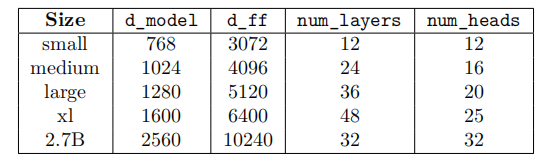
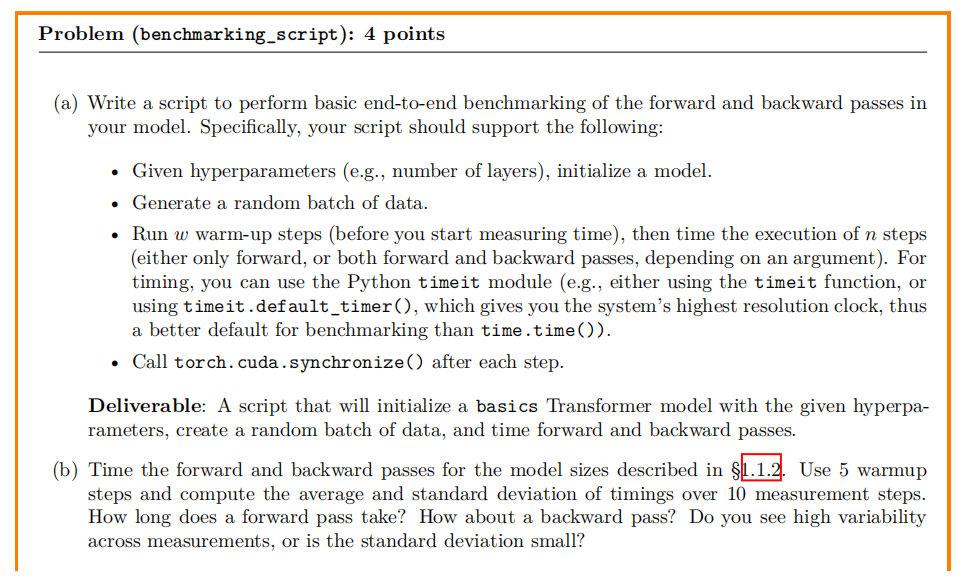
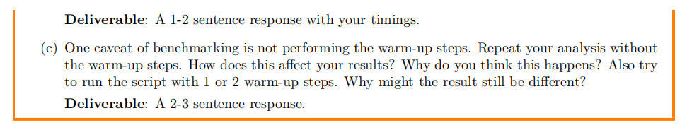
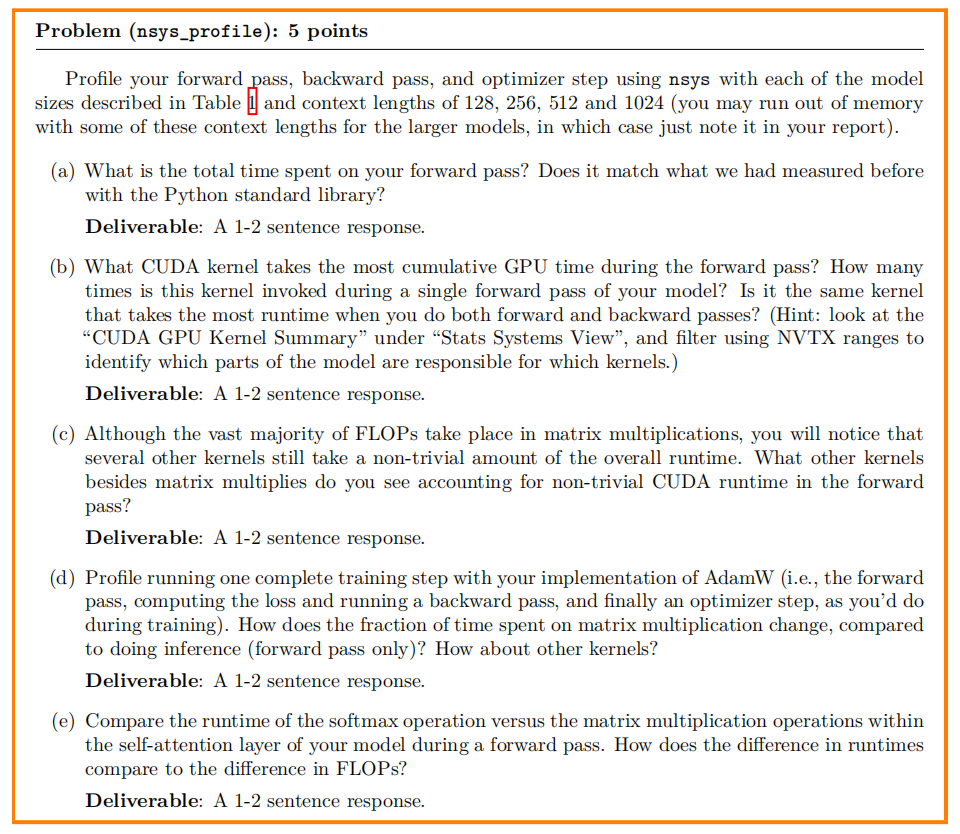
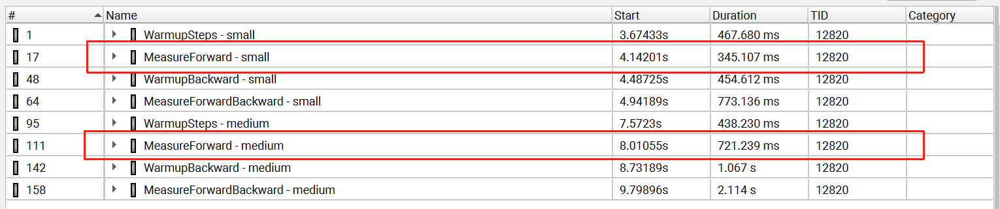
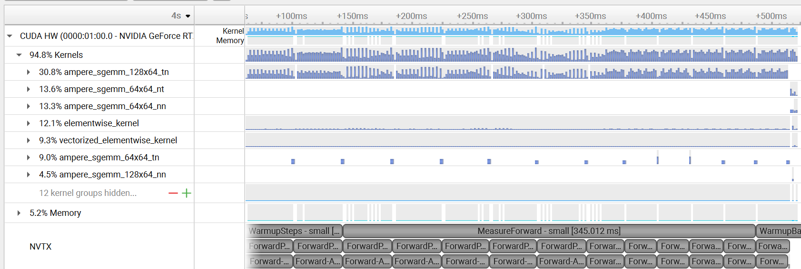
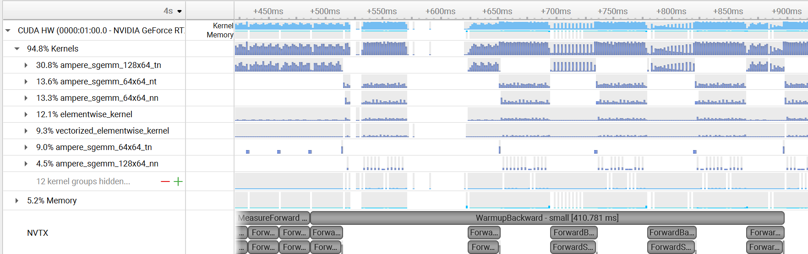
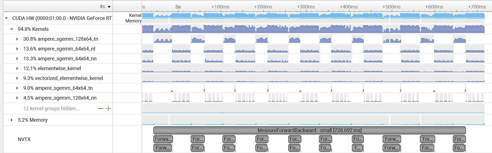

# Week 2
## [Github](https://github.com/stanford-cs336/assignment2-systems/tree/main) | [PDF](https://github.com/stanford-cs336/assignment2-systems/blob/main/cs336_spring2025_assignment2_systems.pdf)
# 1.1.1 准备工作
## 要求：加载assignment1或者直接使用assignment2中提供的Transformer模型
# 1.1.2 模型规模规定
## 要求对于所有模型，使用10，000的词汇量和4的批次大小
# 1.1.3 端到端基准测试
## 问题

<h4 style="text-align: center;">不同模型规模的规格表</h4>




### （a）问：编写一个脚本对模型中的前向和后向传播进行基本的端到端基准测试，要求支持：
- 给定超参数（层数等），初始化一个模型
- 生成一批随机数据
- 运行w个热身步骤（在开始计时之前），然后对n个步骤的执行进行计时（根据参数，要么只进行前向步骤，要么进行前向和后向步骤）。对于计时，你可以使用Python的timeit模块（例如，使用timeit函数，或者使用timeit.default_timer()，它能提供系统最高分辨率的时钟，因此比time.time()更适合作为基准测试的默认选择）
- 每一步之后调用torch.cuda.synchronize()
#### 即，该脚本将使用跟定的超参数初始化一个基础Transformer模型，创建一批随机数据，并对前向和后向传播进行计时

``` python
import argparse
import timeit
import torch
import numpy as np
from cs336_basics.model import BasicsTransformerLM  # 导入模型类

def parse_args():
    # 首先创建一个参数解析器
    parser = argparse.ArgumentParser(description='Transformer基准测试脚本')
    # 添加模型的大小，这里设置了small为默认值，可选值为'small', 'medium', 'large','xl', '2.7B'
    parser.add_argument('--model-size', type=str, default='small',
                        choices=['small', 'medium', 'large', 'xl', '2.7B'])
    # 添加上下文长度参数，默认值为128，后续可进行扩展（1.1.4 节中要求测试多种上下文长度）
    parser.add_argument('--context-length', type=int, default=128)
    # 添加预热步数和测量步数，这里使用了（b）问要求的5次预热、10次测量
    # 预热消除GPU初始化、内核编译等一次性开销，使结果可以较为稳定的反应性能，多次测量提高结果准确性
    parser.add_argument('--warmup-steps', type=int, default=5)
    parser.add_argument('--measure-steps', type=int, default=10)
    # 训练精度
    parser.add_argument('--precision', type=str, default='fp32', choices=['fp32', 'bf16'])
    # 加仅前向传播的标志参数，默认不使用， 控制测试的是前向传播还是整体的传播过程 
    parser.add_argument('--only-forward', action='store_true')
    return parser.parse_args()

def get_model_config(model_size):
    # 根据上表 返回模型配置
    # 格式为(d_model, d_ff, num_layers, num_heads)
    configs = {
        'small': (768, 3072, 12, 12),
        'medium': (1024, 4096, 24, 16),
        'large': (1280, 5120, 36, 20),
        'xl': (1600, 6400, 48, 25),
        '2.7B': (2560, 10240, 32, 32)
    }
    return configs[model_size]

def main():
    args = parse_args()
    device = torch.device('cuda' if torch.cuda.is_available() else 'cpu')

    # seed = 42
    # torch.manual_seed(seed)
    # np.random.seed(seed)
    # if torch.cuda.is_available():
    #     torch.cuda.manual_seed(seed) 
    #     torch.cuda.manual_seed_all(seed) 
    # 发现：；设置不设置随机种子结果都会有轻微波动
    # 即使同一段代码，两次运行时 GPU 的资源占用可能不同，导致执行时间波动，我们这里比较的是运行时间，主要受系统资源和硬件调度影响，需通过多次实验取平均值来降低误差，所以测试步数为10

    # 模型配置与初始化
    d_model, d_ff, num_layers, num_heads = get_model_config(args.model_size)

    # 初始化Transformer语言模型并移动到指定设备
    # 1.1.2中提到对于所有模型，使用10，000的词汇量和4的批次大小
    model = BasicsTransformerLM(
        vocab_size=10000,
        context_length=args.context_length,
        d_model=d_model,
        num_layers=num_layers,
        num_heads=num_heads,
        d_ff=d_ff,
        rope_theta=10000.0  # 补充RoPE参数
    ).to(device)

    # 精度设置
    dtype = torch.float32 if args.precision == 'fp32' else torch.bfloat16
    model = model.to(dtype)

    # 生成随机输入 1.1.3 中要求，因为只是测试速度和内存，因此使用随机的权重和数据 
    # 批次大小是4              (low, high, size, device)
    input_ids = torch.randint(0, 10000, (4, args.context_length), device=device)

    # 定义测试函数

    # 前向传播
    def forward_pass():
        with torch.autocast(device_type='cuda', dtype=dtype, enabled=args.precision != 'fp32'):
            return model(input_ids)

    # 反向传播
    def forward_backward_pass():
        model.zero_grad(set_to_none=True)
        with torch.autocast(device_type='cuda', dtype=dtype, enabled=args.precision != 'fp32'):
            output = model(input_ids) # 前向传播得到模型输出
            loss = output.mean() # 构造简单损失，仅用于触发反向传播
        loss.backward() # 反向传播

    func = forward_pass if args.only_forward else forward_backward_pass

    # 预热五次 
    for _ in range(args.warmup_steps):
        func()
        torch.cuda.synchronize()  # 同步GPU操作以确保计时准确

    # 测量步骤
    times = []
    for _ in range(args.measure_steps):
        start = timeit.default_timer()
        func()
        torch.cuda.synchronize()
        times.append(timeit.default_timer() - start) # 计算并保存耗时

    # 输出结果
    print(f"{args.model_size}模型, 上下文长度{args.context_length}:")
    print(f"平均时间: {np.mean(times):.4f}s ± {np.std(times):.4f}s")


if __name__ == "__main__":
    main()

```
### 这里的代码仅实现了small模型, 上下文长度128的情况，我运行了五组，结果如下

| 模型大小 | 上下文长度 | 平均时间（s） | 标准差（s） |
|----------|------------|---------------|-------------|
| small    | 128        | 0.0776        | 0.0090      |
| small    | 128        | 0.0774        | 0.0057      |
| small    | 128        | 0.0788        | 0.0065      |
| small    | 128        | 0.0799        | 0.0027      |
| small    | 128        | 0.0782        | 0.0046      |
### 可以看到五组时间较为近似，整体波动较小，标准差范围也有波动但较小，整体上比较稳定
#### PS：实际上，多次操作（约20次）中也出现了 平均时间: 0.0803s ± 0.0061s 或者0.09s左右的情况，但次数很少，可能受系统环境波动影响，或者因为随机数据导致计算量出现细微变化等因素影响，但是整体上是稳定的


### （b）问：对1.1.2节中描述的模型规模，测量正向和反向传播的时间。使用5个预热步骤，并在10个测量步骤上计算时间的平均值和标准差。一次正向传播需要多长时间？一次反向传播呢？测量结果的变异性大吗，还是标准差较小？
#### 1.1.2节中强烈建议在代码中自动构建用于报告的表格，推荐使用pandas.DataFrame.to_latex()、pandas.DataFrame.to_markdown()等工具 如下代码使用了pandas.DataFrame.to_markdown()对表格进行格式化

```python
import argparse
import timeit
import torch
import numpy as np
import pandas as pd  # 新增pandas库，用于生成表格
from cs336_basics.model import BasicsTransformerLM

def parse_args():
    parser = argparse.ArgumentParser(description='Transformer基准测试脚本')
    # 移除了--model-size和--only-forward参数
    # 因为需要自动测试多个模型，无需通过参数指定单个模型
    # 前向和反向传播都需要测量，无需--only-forward控制
    parser.add_argument('--context-length', type=int, default=128)
    parser.add_argument('--warmup-steps', type=int, default=5)
    parser.add_argument('--measure-steps', type=int, default=10)
    parser.add_argument('--precision', type=str, default='fp32', choices=['fp32', 'bf16'])
    return parser.parse_args()

def get_model_config(model_size):
    # 格式为(d_model, d_ff, num_layers, num_heads)
    configs = {
        'small': (768, 3072, 12, 12),
        'medium': (1024, 4096, 24, 16),
        'large': (1280, 5120, 36, 20),
        'xl': (1600, 6400, 48, 25),
        '2.7B': (2560, 10240, 32, 32)
    }
    return configs[model_size]

def main():
    args = parse_args()
    device = torch.device('cuda' if torch.cuda.is_available() else 'cpu')

    results = []  # 新增结果列表，用于收集多个模型的测试数据

    # 定义模型规模列表，支持批量测试
    all_model_sizes = ['small', 'medium', 'large', 'xl', '2.7B']  
    print("\n当前测试的模型规模：small、medium、large（因显卡内存限制）\n")
    model_sizes = ['small', 'medium', 'large']  # 本次测试的模型（我的设备是4060，测试下最多能够测试到large）

    # 循环测试模型
    for model_size in model_sizes:
        # 模型配置与初始化
        d_model, d_ff, num_layers, num_heads = get_model_config(model_size)

        model = BasicsTransformerLM(
            vocab_size=10000,  
            context_length=args.context_length,
            d_model=d_model,
            num_layers=num_layers,
            num_heads=num_heads,
            d_ff=d_ff,
            rope_theta=10000.0
        ).to(device)

        dtype = torch.float32 if args.precision == 'fp32' else torch.bfloat16
        model = model.to(dtype)
        input_ids = torch.randint(0, 10000, (4, args.context_length), device=device)  

        # 前向传播函数
        def forward_pass():
            with torch.autocast(device_type='cuda', dtype=dtype, enabled=args.precision != 'fp32'):
                return model(input_ids)

        # 前向+反向传播函数
        def forward_backward_pass():
            model.zero_grad(set_to_none=True)
            with torch.autocast(device_type='cuda', dtype=dtype, enabled=args.precision != 'fp32'):
                output = model(input_ids)
                loss = output.mean()
            loss.backward()

        # 单独测量前向传播（当时的想法是使用--only-forward进行指定，控制是否单独测量前向传播，没注意题干中还需要测试反向传播）
        forward_times = []

        # 前向传播预热
        for _ in range(args.warmup_steps):
            forward_pass()
            torch.cuda.synchronize()

        # 前向传播测量
        for _ in range(args.measure_steps):
            start = timeit.default_timer()
            forward_pass()
            torch.cuda.synchronize()
            forward_times.append(timeit.default_timer() - start)
        forward_mean = np.mean(forward_times)
        forward_std = np.std(forward_times)

        # 测量前向+反向传播
        total_times = []

        # 前向+反向传播预热
        for _ in range(args.warmup_steps):
            forward_backward_pass()
            torch.cuda.synchronize()

        # 前向+反向传播测量
        for _ in range(args.measure_steps):
            start = timeit.default_timer()
            forward_backward_pass()
            torch.cuda.synchronize()
            total_times.append(timeit.default_timer() - start)
        total_mean = np.mean(total_times)
        total_std = np.std(total_times)

        # 计算反向传播时间
        backward_mean = total_mean - forward_mean
        backward_std = np.sqrt(total_std**2 + forward_std** 2)  # 误差传播公式估算反向标准差 原理：若A = B - C，则A的标准差 ≈ sqrt(B的标准差² + C的标准差²)

        # 存储当前模型的所有结果
        results.append({
            '模型规模': model_size,
            '前向平均时间(s)': f"{forward_mean:.4f}",
            '前向标准差(s)': f"{forward_std:.4f}",
            '反向平均时间(s)': f"{backward_mean:.4f}",
            '反向标准差(s)': f"{backward_std:.4f}"
        })

        # 清理内存避免GPU内存溢出
        del model  # 删除当前模型变量
        if device.type == 'cuda':
            torch.cuda.empty_cache()  # 清空GPU缓存

    # 生成表格
    df = pd.DataFrame(results)
    print("\n### 基准测试结果（Markdown表格）")
    print(df.to_markdown(index=False)) 

if __name__ == "__main__":
    main()

```

### 基准测试结果
| 模型规模       | 前向平均时间(s) | 前向标准差(s) | 反向平均时间(s) | 反向标准差(s) |
|----------------|------------------|---------------|------------------|---------------|
| small          | 0.0416           | 0.0044        | 0.0404           | 0.01          |
| small          | 0.0302           | 0.0061        | 0.0524           | 0.0088        |
| small          | 0.0363           | 0.0033        | 0.05             | 0.0092        |
| small          | 0.0381           | 0.0088        | 0.048            | 0.0122        |
| small          | 0.0287           | 0.0059        | 0.0569           | 0.0149        |
| **small平均值** | **0.0349**       | **0.0057**    | **0.0495**       | **0.0110**    |
|                |                  |               |                  |               |
| medium         | 0.0742           | 0.0028        | 0.1598           | 0.0119        |
| medium         | 0.0734           | 0.0054        | 0.1558           | 0.0071        |
| medium         | 0.0748           | 0.0062        | 0.158            | 0.0126        |
| medium         | 0.0733           | 0.0023        | 0.1616           | 0.0082        |
| medium         | 0.0726           | 0.0017        | 0.1526           | 0.003         |
| **medium平均值**| **0.0737**       | **0.0037**    | **0.1576**       | **0.0086**    |
|                |                  |               |                  |               |
| large          | 0.1554           | 0.0037        | 0.5384           | 0.0161        |
| large          | 0.1576           | 0.0038        | 0.5274           | 0.033         |
| large          | 0.1567           | 0.0048        | 0.5285           | 0.0165        |
| large          | 0.1562           | 0.0056        | 0.5435           | 0.0141        |
| large          | 0.1546           | 0.0018        | 0.5441           | 0.0231        |
| **large平均值** | **0.1557**       | **0.0039**    | **0.5364**       | **0.0204**    |

### 参数规模表
| 模型规格 | 配置 (d_model, d_ff, num_heads, num_layers) | 词嵌入层参数 (亿) | 注意力层总参数 (亿) | 前馈网络总参数 (亿) | 归一化层总参数 (亿) | LM Head参数 (亿) | 总参数量 (亿) |
|----------|--------------------------------------------|-------------------|---------------------|---------------------|---------------------|------------------|---------------|
| small    | (768, 3072, 12, 12)                        | 0.077             | 3.48                | 8.85                | 0.02                | 0.077             | 12.50         |
| medium   | (1024, 4096, 24, 16)                       | 0.102             | 10.99               | 20.13               | 0.03                | 0.102             | 31.36         |
| large    | (1280, 5120, 36, 20)                       | 0.128             | 23.04               | 38.40               | 0.04                | 0.128             | 61.74         |
| xl       | (1600, 6400, 48, 25)                       | 0.160             | 48.00               | 76.80               | 0.05                | 0.160             | 125.17        |
| 2.7B     | (2560, 10240, 32, 32)                      | 0.256             | 83.97               | 251.90              | 0.08                | 0.256             | 336.46        |
## 分析
### 现象：规模从small到large,参数量增长约4.94 倍,前向传播时间增长了约4.5倍，反向传播时间增长了约10.8倍，反向传播时间增长远超前向，差异源于两者的计算逻辑和硬件开销特性
#### 随着模型从large向xl和2.7B扩展，参数规模呈指数级增长（10 倍→26.9 倍），但反向传播时间的增长可能更陡峭，因此训练大规模模型时会出现计算成本激增。
#### 原因：
#### 前向传播：主要涉及矩阵乘法（如自注意力中的 QKV 计算、前馈网络的线性变换）和激活函数运算，计算过程中数据流向清晰（从输入到输出），中间结果可按层依次释放，硬件开销相对稳定
#### 反向传播：需通过链式法则从损失值反向推导所有参数的梯度，计算量约为前向传播的 2 倍，反向传播依赖前向传播保存的所有中间激活值（如注意力权重、线性层输出）大幅增加 GPU 内存读写压力和缓存命中率波动，从而使硬件开销随规模呈非线性增长

### 前向传播和反向传播的比例分别为
| 模型规模       | 前向传播       | 反向传播        |
|---------------|----------------|---------------|
| small         | 1              |  1.4          |
| medium        | 1              |  2.1          |
| large         | 1              |  3.4          |
### 现象：比例随模型规模增大而上升，小规模模型的前向传播与反向传播比例低于理论预期的 1:2，中规模模型更接近理论值，大规模模型则高于理论预期
#### 原因：小规模模型中 “非计算性固定开销” 占比更高，掩盖了反向传播本身的计算开销优势
#### 在理想情况下，模型规模足够大、计算量主导耗时，反向传播的时间约为前向传播的 2 倍，但实际中因内存读写（中间激活值的加载 / 存储）额外增加了耗时，因此总耗时往往超过 2 倍

#### 表格中出现1.4倍是因为小规模模型参数少、计算量小，此时 非计算性的 “固定开销” （如 GPU 线程启动、内存分配、框架调度等）在总耗时中占比更高，稀释了反向传播本身的计算开销优势，导致比例低于 2 倍。此外，小规模模型的计算量不足以充分利用 GPU 的计算核心，反向传播的额外计算（如梯度计算）在硬件利用率低的情况下，其耗时增加并不明显，因为 GPU 本身有空闲资源处理
#### 随着模型规模增大（如 medium），计算量成为耗时的主导因素，固定开销占比下降，比例上升到1:2
#### 模型规模更大时，数据量远超GPU缓存容量，反向传播时需频繁从全局内存读写数据，这样计算量因为内存操作等增加了额外开销，导致比例进一步升高

### （c）问：基准测试的一个注意事项是未执行预热步骤。在不进行预热步骤的情况下重复你的分析。这会如何影响你的结果？你认为为什么会发生这种情况？另外，尝试使用1或2个预热步骤运行脚本。为什么结果可能仍然不同？

#### 当设置--warmup-steps 0（无预热）时，测量结果会显著偏大且波动性更高。GPU 存在初始化开销（如 CUDA 上下文创建、内核编译、缓存加载等），这些一次性操作会被计入首次测量的时间中干扰真实计算时间的测量
#### 即使设置--warmup-steps 1或2，测量结果仍可能与 5 个预热步骤的结果存在差异。1-2 个预热步骤可能仅能消除部分初始化开销，但未完全稳定 GPU 的计算状态，导致后续测量仍受影响
``` python

def parse_args():
    '''……'''

    # （c）问 仅修改（a）问中预热步数的参数，其他地方不需要改动
    parser.add_argument('--warmup-steps', type=int, default=0)

    '''……'''


```
### 结果汇总
| 预热设置 | 单次测量平均时间(s) | 标准差(s) |
|----------|---------------------|-----------|
| 未预热   | 0.1631              | 0.2420    |
| 未预热   | 0.1491              | 0.2085    |
| 未预热   | 0.1198              | 0.1284    |
| 未预热平均值 | **0.1440**         | **0.1929** |
| 预热1步  | 0.0836              | 0.0069    |
| 预热1步  | 0.0746              | 0.0059    |
| 预热1步  | 0.0818              | 0.0095    |
| 预热1步平均值 | **0.0800**        | **0.0074** | 

# 1.1.4 Nsight Systems性能分析器

## 这里要求使用nsys来分析
### 主要命令: nsys profile -o {model_size}_nsight_result --target-processes=python python {__file__} --model-size {model_size}
### 还需要使用NVTX进行范围注释,从而定位该函数内部各计算环节的耗时
``` python
import torch.cuda.nvtx as nvtx

@nvtx.range("scaled dot product attention")
def annotated_scaled_dot_product_attention(
    ... # Q, K, V, mask
7 )
8   ...
9   with nvtx.range("computing attention scores"):
10      ... # compute attention scores between Q and K
11
12  with nvtx.range("computing softmax")
13      ... # compute softmax of attention scores
14
15  with nvtx.range("final matmul")
16      ... # compute output projection
17
18  return ...
```
### 前提：使用nsys对表1中描述的每种模型规模以及上下文长度为128、256、512和1024的前向传播、反向传播和优化器步骤进行性能分析（对于较大的模型，某些上下文长度可能会导致内存不足，在这种情况下，只需在报告中注明即可）。
### （a）问：前向传递总共花费了多少时间？这个时间与我们之前使用Python标准库测量的时间一致吗？
``` python
import argparse
import timeit
import torch
import numpy as np
import pandas as pd
from cs336_basics.model import BasicsTransformerLM
import torch.cuda.nvtx as nvtx  # 【必须】导入NVTX工具


def parse_args():
    parser = argparse.ArgumentParser(description='Transformer基准测试（带NVTX标记）')
    parser.add_argument('--context-length', type=int, default=128)
    parser.add_argument('--warmup-steps', type=int, default=5)
    parser.add_argument('--measure-steps', type=int, default=10)
    parser.add_argument('--precision', type=str, default='fp32', choices=['fp32', 'bf16'])
    return parser.parse_args()


def get_model_config(model_size):
    configs = {
        'small': (768, 3072, 12, 12),
        'medium': (1024, 4096, 24, 16),
        'large': (1280, 5120, 36, 20),
    }
    return configs[model_size]


def main():
    args = parse_args()
    device = torch.device('cuda' if torch.cuda.is_available() else 'cpu')
    results = []
    model_sizes = ['small', 'medium']  # 可根据显存调整

    for model_size in model_sizes:
        d_model, d_ff, num_layers, num_heads = get_model_config(model_size)
        model = BasicsTransformerLM(
            vocab_size=10000,
            context_length=args.context_length,
            d_model=d_model,
            num_layers=num_layers,
            num_heads=num_heads,
            d_ff=d_ff,
            rope_theta=10000.0
        ).to(device)

        # 【补全】定义dtype等变量，否则代码片段中会报错
        dtype = torch.float32 if args.precision == 'fp32' else torch.bfloat16
        model = model.to(dtype)
        input_ids = torch.randint(0, 10000, (4, args.context_length), device=device)

        # ============= 前向传播函数（带NVTX标记） =============
        def forward_pass():
            with nvtx.range(f"ForwardPass - {model_size}"):  # 标记整体阶段
                with torch.autocast(device_type='cuda', dtype=dtype, enabled=args.precision != 'fp32'):
                    # 【优化】拆分模型内部阶段（如注意力、输出），需根据model(input_ids)实际逻辑调整
                    with nvtx.range(f"Forward-Attention - {model_size}"):
                        output = model(input_ids)
                    with nvtx.range(f"Forward-Output - {model_size}"):
                        # 若有后处理可在此标记
                        pass
            return output

        # ============= 前向+反向传播函数（带NVTX标记） =============
        def forward_backward_pass():
            with nvtx.range(f"ForwardBackwardPass - {model_size}"):  # 标记整体阶段
                model.zero_grad(set_to_none=True)

                # 前向子阶段
                with nvtx.range(f"ForwardSubPass - {model_size}"):
                    with torch.autocast(device_type='cuda', dtype=dtype, enabled=args.precision != 'fp32'):
                        output = model(input_ids)
                        loss = output.mean()

                # 反向子阶段（核心反向传播）
                with nvtx.range(f"BackwardSubPass - {model_size}"):
                    loss.backward()
            return loss

        # ============= 热身步骤（带NVTX标记） =============
        with nvtx.range(f"WarmupSteps - {model_size}"):
            for _ in range(args.warmup_steps):
                forward_pass()
                torch.cuda.synchronize()  # 同步确保GPU任务完成

        # ============= 前向传播测量（带NVTX标记） =============
        forward_times = []
        with nvtx.range(f"MeasureForward - {model_size}"):
            for _ in range(args.measure_steps):
                start = timeit.default_timer()
                forward_pass()
                torch.cuda.synchronize()
                forward_times.append(timeit.default_timer() - start)
        forward_mean = np.mean(forward_times)
        forward_std = np.std(forward_times)

        # ============= 热身+反向传播测量（带NVTX标记） =============
        # 反向传播需要重新热身（避免受前向影响）
        with nvtx.range(f"WarmupBackward - {model_size}"):
            for _ in range(args.warmup_steps):
                forward_backward_pass()
                torch.cuda.synchronize()

        total_times = []
        with nvtx.range(f"MeasureForwardBackward - {model_size}"):
            for _ in range(args.measure_steps):
                start = timeit.default_timer()
                forward_backward_pass()
                torch.cuda.synchronize()
                total_times.append(timeit.default_timer() - start)
        total_mean = np.mean(total_times)
        total_std = np.std(total_times)

        # 计算反向传播时间（总时间-前向时间）
        backward_mean = total_mean - forward_mean
        backward_std = np.sqrt(total_std ** 2 + forward_std ** 2)

        results.append({
            '模型规模': model_size,
            '前向平均时间(s)': f"{forward_mean:.4f}",
            '前向标准差(s)': f"{forward_std:.4f}",
            '反向平均时间(s)': f"{backward_mean:.4f}",
            '反向标准差(s)': f"{backward_std:.4f}"
        })

        # 清理内存
        del model
        if device.type == 'cuda':
            torch.cuda.empty_cache()

            # 生成结果表格
    df = pd.DataFrame(results)
    print("\n### 基准测试结果（Markdown表格）")
    print(df.to_markdown(index=False))


if __name__ == "__main__":
    main()
```
### 这里因为采集内容较多（？）导致large运行会崩溃因此只测试了small和medium 
| 模型规模   |   前向平均时间(s) |   前向标准差(s) |   反向平均时间(s) |   反向标准差(s) |
|:-----------|------------------:|----------------:|------------------:|----------------:|
| small      |            0.0345 |          0.0065 |            0.0428 |          0.0083 |
| medium     |            0.0721 |          0.0007 |            0.1393 |          0.0029 |
| **python标准库small平均值** | **0.0349**       | **0.0057**    | **0.0495**       | **0.0110**    |
| **python标准库medium平均值**| **0.0737**       | **0.0037**    | **0.1576**       | **0.0086**    |
### 结合result.nsys-rep文件中显示的内容

### 可以看到前向传递花费的时间与python标准库测量的时间基本上是一致的

### （b）问：在前向传播过程中，哪个CUDA内核占用的累计GPU时间最多？在模型的单次前向传播中，这个内核被调用了多少次？当同时进行前向和反向传播时，占用运行时间最多的内核是否相同？（提示：查看“统计系统视图”下的“CUDA GPU内核摘要”，并使用NVTX范围进行过滤，以确定模型的哪些部分对应哪些内核。）
### 小模型前向

### 反向

### 总计

##### 这里还没有看懂这个图……

##### 我使用的是Windows 11 ，NVIDIA 4060RTX 文件中附上了我使用环境的requirements.txt（因为该环境是我之前使用过的可能会有不必要的包等内容）