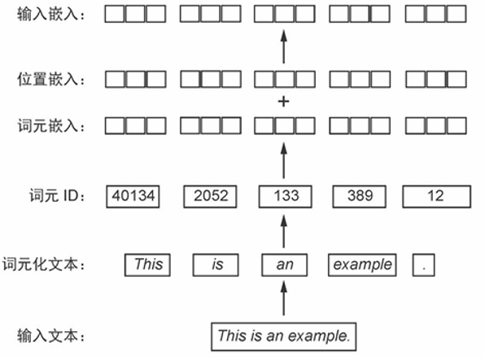
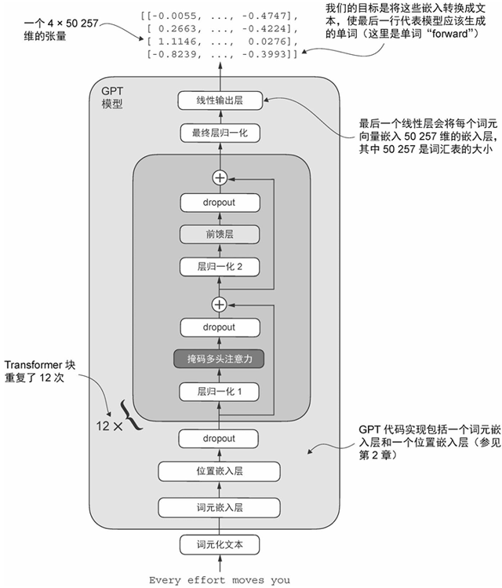
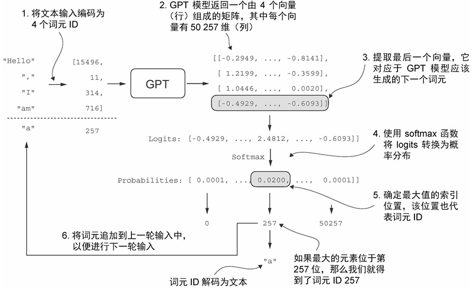
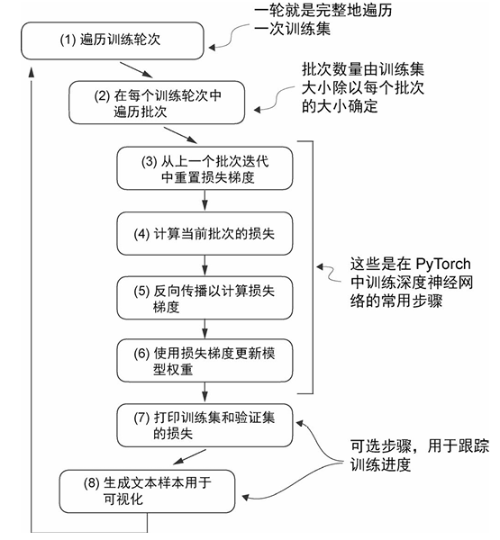

# Summarization_week2

### PPT-zyx

------

>  分享完整的大模型训练流程

- **数据准备**:

  - 使用分词器（如**BPE**）将输入文本划分为词元

  - 根据分词器的划分，构建词元到词元ID的双向映射（**字典**）

  - 将词元ID转换为嵌入向量，本质上是查找操作，可以通过**torch.nn.Embedding(vocab_size, emb_dim)**来实现

  - 使用位置编码，嵌入位置信息（绝对位置编码、相对位置编码、**RoPE**）

    

- **模型机构设计**:

  - LayerNorm的详细思想以及公式原理，举例RMSNorm、LayerNorm

  - 激活函数：RELU、GELU、GeGLU、SwiGLU进行绘图对比讲解

  - FFN(**详细展示了GPT-2 124M模型架构**)的组成设计

    

- **预训练**:

  - 大模型生成文本的过程：原理是通过“下一词预测”的方法生成文本的，即每一步只生成一个词元，并将该词元添加到输入中，用于预测下一词元。

     

  - 损失函数:交叉熵损失`（torch.nn.functional.cross_entropy(logits_flat, targets_flat) ）`

  - 预训练的详细过程(**Q1**)
   

- **前沿大模型训练技巧**:总结了常见的大模型训练方法，主要介绍层的组成、是否预训练、具体所使用的不同的层正则化方法和位置编码方法、激活函数等，另外详细介绍了**混合专家(MOE)**的模型架构原理以及优缺点

------

### Implement-zxy

>  讲解作业Assignment2的第一部分

- 编写脚本对模型中的前向和后向传播进行基体的端到端基准测试(**Q2**)
- 详细对比分析预热对测量结果的影响，展示不同规模的情况下(small、medium、large)前向传播和反向传播的时间开销和比例，分析这种现象出现的原因
- 分析了无预热步骤产生的影响
- 使用性能分析器NVTX来标注前向传播的时间，测试了small和medium规模的模型，得到的测量结果和使用python标准库所测量的结果基本相同。
- 分析前向传播过程中CUDA核占用GPU的时间，被调用的次数，以及在反向传播中结果是否相同。

### Teacher‘s suggestion

- 要提前去讨论作业细节，作业完成之后再进行讲解
- 都在服务器使用3090来完成作业**保证开发环境相同**

### **Questions and Answers**

- **Q1**:怎么结合tensorboard可视化训练数据？

​	**A1**:编写代码调用`tf.summary` API 将模型训练过程中的各类信息（如损失、精度、权重等）记录下来，然后使用 **TensorBoard** 进行查看。

​	**Suggestion**:训练模型时最好加上这种tensorboard来对训练数据进行监控，以便于分析纠错。

- **Q2**:基准测试对照中不同规模的参数量是多少？

​	**A2**:没有做参数量的标注。

​	**Suggestion**:正是因为不同规模的参数量不同才导致的前向反向时间产生变化，所以一定要详细标注进行分析。