# Week 5
# 课件内容总结
## CPU与GPU结构对比
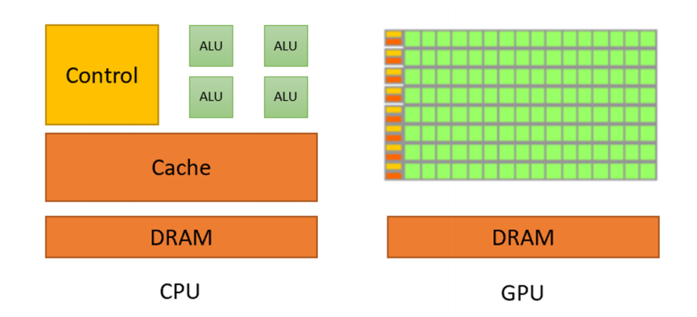
### CPU部件及作用
| 组件（Component） | 核心功能描述（Core Function Description） |
|------------------|------------------------------------------|
| Control          | 负责指令的解析与调度                     |
| ALU              | 负责算术运算和逻辑运算，每个 ALU 可处理复杂但串行化的任务 |
| Cache            | 是 CPU 与 DRAM 之间的高速缓冲存储器，用于存储近期频繁访问的数据和指令，减少 CPU 访问 DRAM 的次数，提升运算效率 |
| DRAM             | 即主存，用于存储程序运行时的指令、数据等。CPU 需要的信息若不在 Cache 中，会从 DRAM 中读取 |

## GPU部件及作用
### GPU内部集成了极大数量的SM单元（类似于核心处理器）图中密集的绿色单元，GPU 的控制逻辑相对简单，更强调数据的并行传输与批量处理

| 组件（Component） | 核心功能描述（Core Function Description） |
|------------------|------------------------------------------|
| SM（流式多处理器） | 可视为 GPU 运算的基本单元，操作层级以单个 SM 为单位，每个流式多处理器内部包含多个 SP（流处理器） |
| SP（流处理器）   | 流处理器的核心功能是并行执行大量线程，是实现 GPU 并行计算能力的关键执行单元 |
| DRAM（主存）     | 即动态随机存取存储器，作为计算机系统的主存储器，用于存储程序运行过程中所需的指令、数据等关键信息 |

## CPU并行计算特性
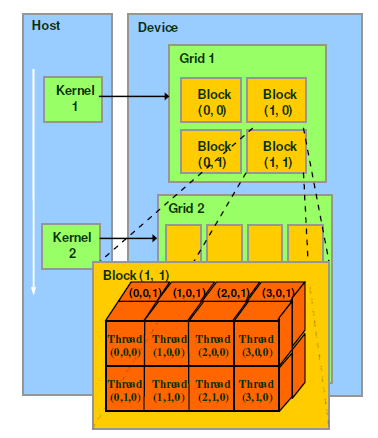
### GPU在任务调度层级上还具有单指令多线程的特性，每一个线程束中的线程都会执行相同的命令
| 组件（Component） | 核心功能描述（Core Function Description） |
|------------------|------------------------------------------|
| 线程块（Thread Block） | 由大量线程组成的较大分组，分配机制为每个线程块对应一个SM（流式多处理器）；SM作为独立工作单元可自主运行，被分配的线程块将由对应SM完成处理 |
| 线程束（Warp）   | 线程块内的“隐式调度层级”，线程执行时以线程束为单位运行，标准组成规格为32个连续编号的线程 |
| 线程（Thread）  | 程序中需执行的单个任务片段，每个线程可独立访问自身的寄存器与共享内存；若需实现跨线程块的信息交互，需将数据写入全局内存 |

## 内存访问优化
### 非合并内存访问、合并内存访问
| 内存访问类型       | 核心特征与原理       | 内存读取操作次数 |
|--------------------|--------------------|------------------|
| 非合并内存访问     | 每个线程访问的地址不连续，读取的数据分属不同的突发传输区段                     | 需进行多次内存读取，甚至可能需要读取整块内存 |
| 合并内存访问       | 所有线程访问的地址连续，读取的数据位于单个突发传输区段内                       | 仅需进行一次内存读取操作 |

## 基准测试与性能分析
### 基准测试
1 做基准测试需要进行一定数量的 *预热迭代* 因为我们想要确保测量的是稳态下的速度而不是启动状态下的速度

2 调用 *torch.cuda.synchronize* 实现同步操作 调用这个函数，确保GPU和CPU处于相同的状态
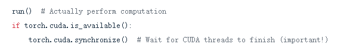

### 基准测试相对来说比较粗粒度，只会告诉我们运行的快慢，但不能定位到具体的某一部分,因此我们要进行性能分析
### 性能分析相比于原始的基准测试，可以帮助我们看到运行时间的分布，更加具体的CUDA内核调用

1 *异步执行与队列机制* 通过异步性实现硬件的高效利用

2 *同步点的影响* 极端情况下的频繁调度会造成CPU瓶颈

## 分类微调
### 所谓分类微调，即模型被训练来识别一组 *特定的类别标签* ，比如在消息中过滤“垃圾消息”和“非垃圾消息”
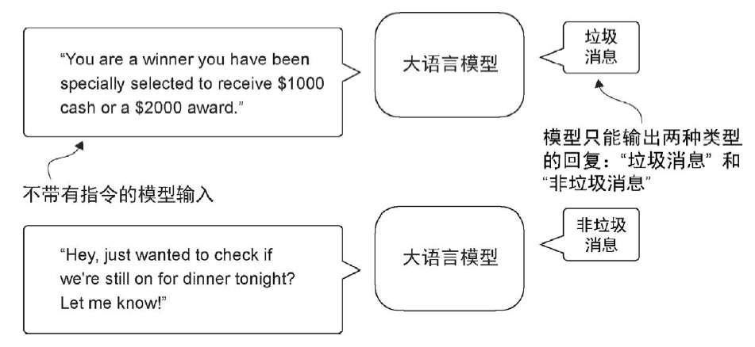
### 经过垃圾消息数据分类微调的模型在输入时不需要提供额外的指令。与经过指令微调的模型相比，它只能回复“垃圾消息”或“非垃圾消息”

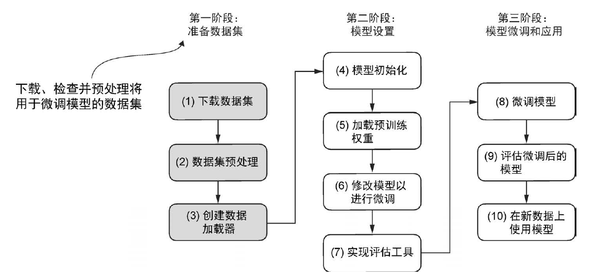

| 阶段             | 步骤                | 核心操作                                         |
|------------------|------------------|---------------------------------------------------|
| 准备数据集       | 1. 下载数据集       | 获取文本分类数据集（如垃圾消息/非垃圾消息数据集）    |
|                  | 2. 数据集预处理     | - 构建平衡数据集：采样“非垃圾消息”使与“垃圾消息”数量一致（代码：`create_balanced_dataset`）； - 文本长度处理：填充至最长消息/批次长度（用50256作为填充词元）； - 拆分数据集：打乱后按比例分训练集、验证集、测试集（代码：`random_split`）                  |
|                  | 3. 创建数据加载器   | 示例设置`batch_size=8`   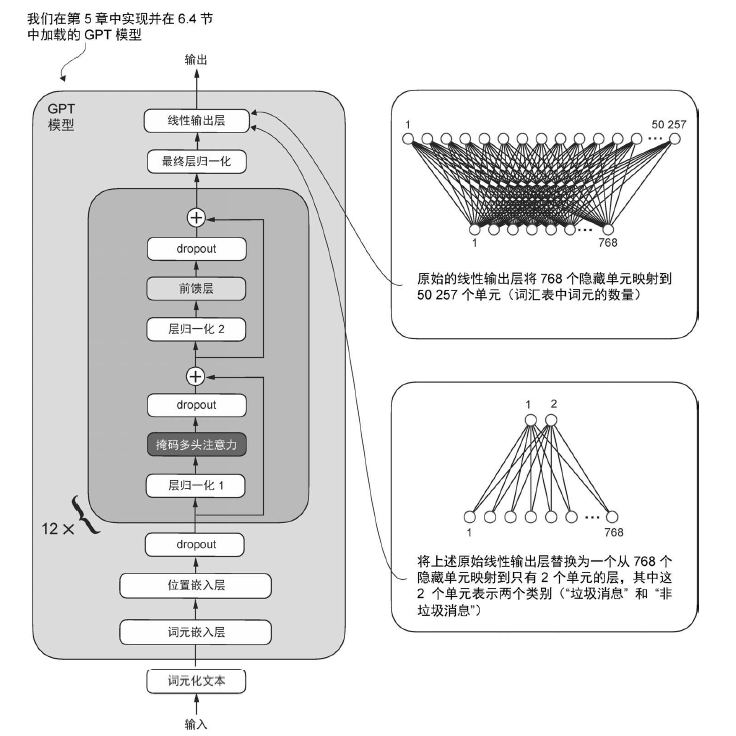   目标为类别标签（1=垃圾消息，0=非垃圾消息）而不是文本中的下一个词元                         |
| 模型设置         | 4. 模型初始化       | 加载预训练基础模型                                 |
|                  | 5. 加载预训练权重   | 导入GPT-2等预训练权重                              |
|                  | 6. 修改模型        | - 冻结大部分层：`param.requires_grad = False`； - 解冻关键层：最后1个Transformer块、`final_norm`层； - 替换输出层：将原50257词元输出层改为2分类线性层 |
|                  | 7. 实现评估工具     | 损失函数：交叉熵损失；评估指标：分类准确率           | 
| 模型微调和应用    | 8. 微调模型         | 训练解冻的关键层及分类头                           |
|                  | 9. 评估模型         | 用验证集/测试集计算准确率                          |
|                  | 10. 应用模型        | 对新文本数据进行分类                              |

### 当我们在处理数据的时候，处理的数据包含了不同的长度，为了保持文本能够按批次处理，有两种方案
#### 1 将所有消息 *截断* 到数据集中 *最短* 消息的长度或批次长度
#### 2 将所有消息 *填充* 到数据集中 *最长* 消息的长度或批次长度
#### 保证输入的shape一致。在这里选择第二种方案，保证保留所有消息的完整内容，不会有信息的丢失

## 指令微调
### 指令微调和分类微调对比
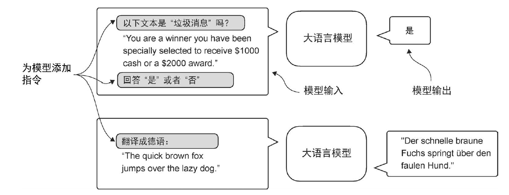

| 对比维度       | 分类微调                     | 指令微调                     |
|----------------|------------------------------|------------------------------|
| 模型结构       | 需修改输出层（添加分类头，将原词元输出层改为对应类别数的线性输出层） | 无需改变模型结构（直接基于预训练模型架构，不调整输出层结构） |
| 模型输入       | 仅输入待分类文本，无额外指令（如直接输入“你已被选中获得1000美元现金”） | 输入包含“指令+文本”，需明确任务要求（如“判断以下文本是否为垃圾消息，回答‘是’或‘否’：你已被选中获得1000美元现金”） |
| 输出结果       | 仅输出预设的类别标签（如“垃圾消息”“非垃圾消息”，输出形式固定） | 输出遵循指令的自然语言回复（如指令要求“是/否”则输出“是”，指令要求“翻译”则输出对应译文，输出形式灵活） |

## 为什么需要指令微调
### 指令微调（也被称为有监督指令微调）：预训练后的大语言模型在执行特定指令时往往表现不佳，比如无法完成像“纠正这段文字的语法”或“将这段话变成被动语态”这样的指令。
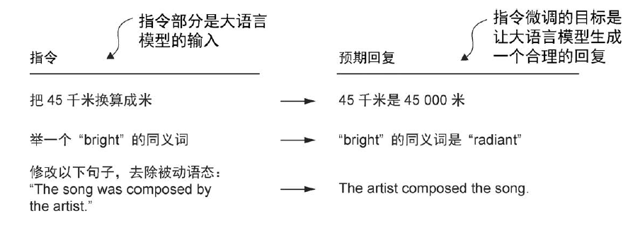

## 输入数据风格：
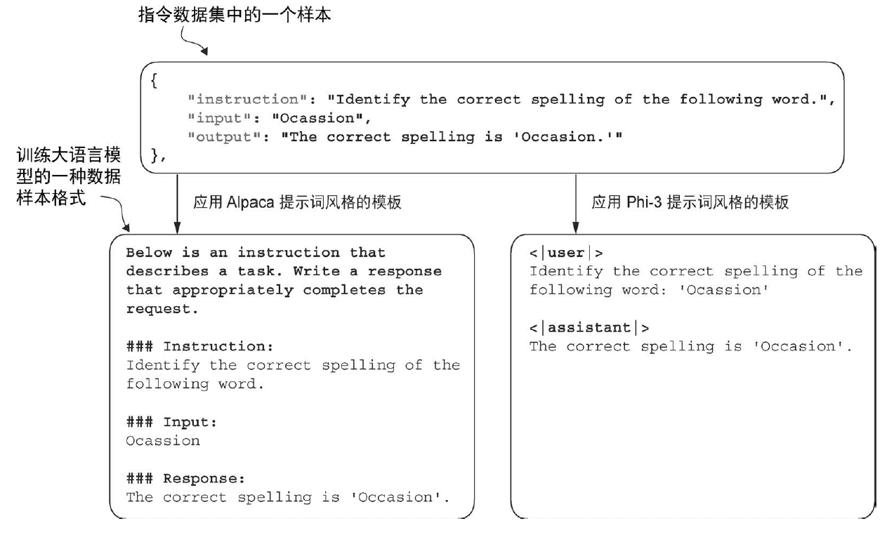
### Alpaca (左) : 是最早公开详细说明其指令微调过程的大语言模型之一
### Phi-3 （右）: 则使用了更简单的形式，主要借助的是特殊词元<|user|>和<|assistant|>

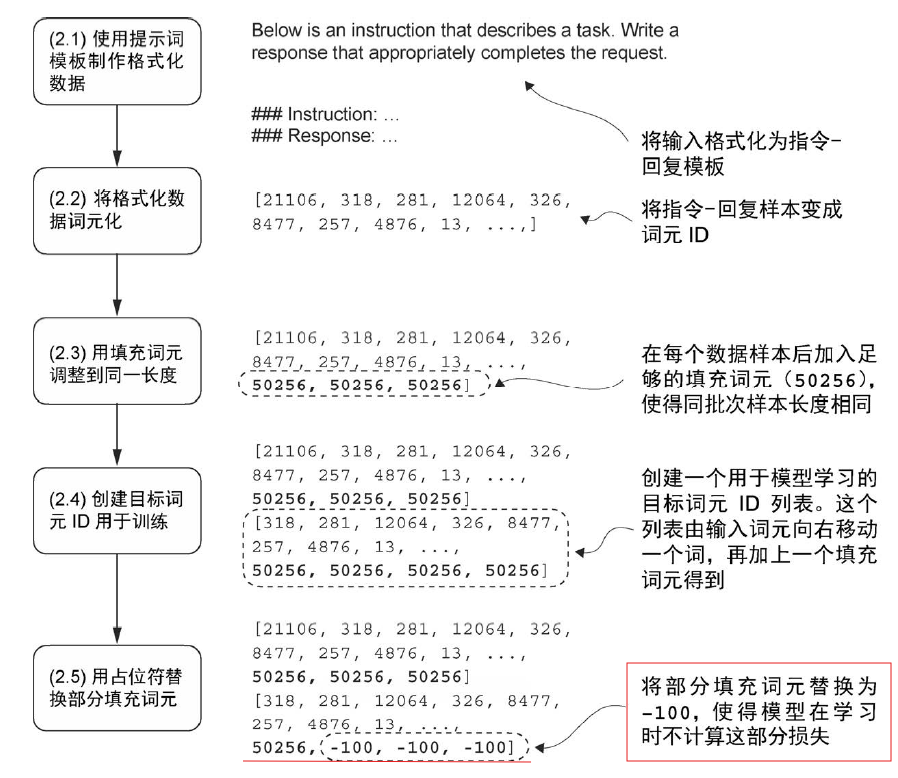
## 目标词元ID是什么呢：
### 与我们预训练大语言模型时的做法相似，目标词元ID 与输入词元ID 相对应，但向左移动了一个位置。使得大语言模型能够学习如何预测序列中的下一个词元。
## 为什么用-100去填充呢：
### 在计算交叉熵损失的时候默认设置ignore_index=-100这意味着它会忽略标记为-100 的目标。从而不影响loss

## 执行流程
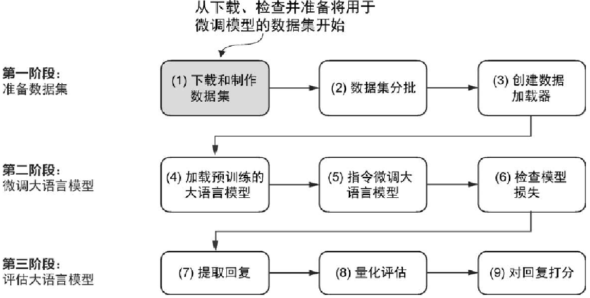

| 阶段             | 步骤                | 核心操作                                       |
|------------------|---------------------|-----------------------------------------------|
| 准备数据集       | 1. 下载/制作数据集  | 获取含`instruction`（指令）、`input`（输入）、`output`（输出）的样本，示例：`{"instruction": "纠正拼写", "input": "Ocassion", "output": "Occasion"}` |
|                  | 2. 数据集分批       | 按批次划分数据集，为后续训练做准备                                       |
|                  | 3. 创建数据加载器   | 配置数据加载器参数，保证同批次内所有样本长度一致，满足模型批量训练需求     |
| 微调大语言模型   | 4. 加载预训练模型   | 导入GPT-2等预训练基础模型，复用预训练阶段学习到的通用语言知识             |
|                  | 5. 微调模型         | 调用与GPT模型训练一致的`train_loop`函数，对预训练模型进行指令微调训练     |
|                  | 6. 检查模型损失     | 实时监控训练集与验证集的损失变化，通常损失会随训练轮数增加逐渐下降并趋于收敛，以此判断模型训练进度与效果 |
| 评估大语言模型   | 7. 提取回复         | 调用模型的`generate`生成函数，输入指令文本，获取模型遵循指令生成的回复   |
|                  | 8. 量化评估         | 采用多维度评估方式： - MMLU（Measuring Massive Multitask Language Understanding）：用于考查模型综合知识； - LMSYS 聊天机器人竞技场：用于进行人类偏好比较； - AlpacaEval：借助GPT-4等模型对回复进行自动评估 |
|                  | 9. 回复打分         | 根据量化评估结果，对模型回复的准确性、相关性、完整性等维度打分，判断微调后模型的指令遵循能力 |

## 数据精度对训练时间和占用内存的影响
### 通常默认情况下，实验都是 *FP32（单精度浮点数）* 进行计算，所有模型参数和激活值的数据类型均为 torch.float32。现代 GPU（如 NVIDIA Ampere、Volta、Turing 系列）在 FP16 计算上有专门的加速单元。FP16 的运算速度通常是 FP32 的 *2～8* 倍。 但是简单地将模型强制转换为低精度格式可能会降低模型精度，为了充分利用低精度数据类型的加速优势，通常会采用 *混合精度训练（mixed-precision training）*。
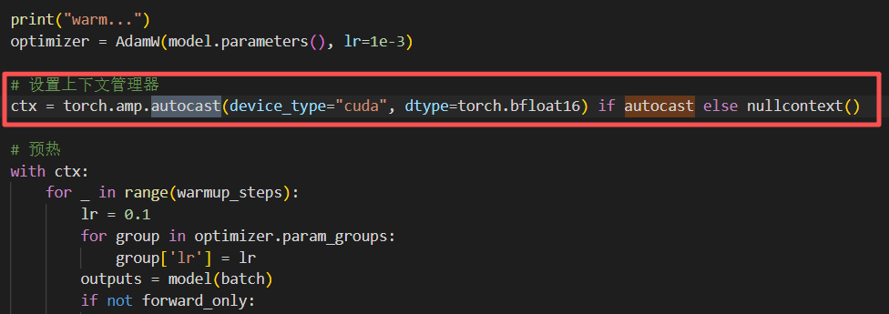

## Pytorch即时编译器JIT的影响
### JIT自动对PyTorch函数应用多种优化。编译器会通过动态分析计算图，尝试自动生成融合的Triton内核。
### 工作流程：捕获 Python 中的逐算子执行 → 变成可优化的计算图 → 生成高效内核 → 运行并缓存复用。
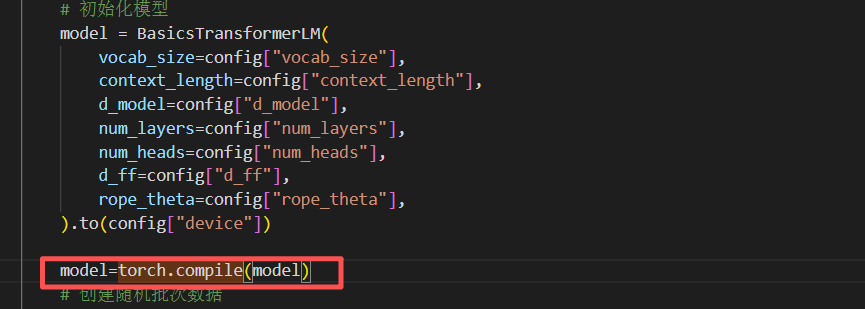

## FlashAttention-2 
### 主要思想：与Transformer中标准注意力保持数学上完全相同的结果，但重写计算路径以减少显存/带宽开销与 kernel 次数。
### 核心技术
| 优化技术                 | 核心原理与操作步骤                                             |
|--------------------------|--------------------------------------------------------------|
| 分块（tiling）加载到片上存储 | 1. 将注意力计算中的K（键矩阵）、V（值矩阵）分割为若干小块； 2. 将Q（查询矩阵）也按对应粒度拆分为小块并逐块遍历； 3. 仅在GPU片上存储当前计算所需的Q/K/V小块，在片上完成该块的矩阵乘法、归一化等运算； 4. 不将完整的N×N注意力矩阵（S）写入显存，仅保留中间计算结果。 |
| 在线softmax与数值稳定     | 1. 针对注意力矩阵的每一行（对应单个查询的注意力计算），按块处理K/V数据； 2. 维护两个关键参数：当前行的最大值（m）和归一化常数（l）； 3. 每处理一个新的数据块，基于该块的计算结果增量更新m和l； 4. 通过实时更新的m和l保证softmax计算的数值稳定性，避免溢出或精度损失。 |
| 必要时重计算而非写回显存 | 1. 正向传播过程中，不将完整的N×N注意力矩阵存储到显存中； 2. 反向传播需要注意力矩阵数据时，根据原始的Q/K/V小块和分块计算逻辑，重新逐块计算所需的注意力信息； 3. 以少量额外的计算时间为代价，大幅降低正向传播时的峰值显存占用。 |
| 算子融合/并行度设计      | 1. 算子融合：将注意力计算中的多个独立小算子（如矩阵乘法、缩放、masking、softmax、与V的乘法）融合为少数几个复合kernel，减少GPU kernel的启动次数和同步开销，降低内存往返频率； 2. 并行度设计：在GPU硬件层面，通过“split-Q”策略（拆分Q矩阵分配给不同线程块）、跨序列维度并行等方式，合理划分线程块和warp的计算任务，提升GPU计算核心的占用率和FLOP（浮点运算次数）利用率。 |

# Q＆A

### Q ：硬件的知识讲了两节课作用是什么
### A ：硬件知识是后续[并行化课程](https://www.bilibili.com/video/BV1pAjUzYEaK?vd_source=79621440bd0dc758155ce18eab233de5&spm_id_from=333.788.videopod.episodes&p=7)的关键基础，并行化涉及多处理器、多核等硬件架构下的计算任务分配与协同，了解CPU与GPU的并行特性以及内存访问等方面的差异才能够更好地利用硬件资源。

#### 附：[和鲸社区发布的微信公众号](https://mp.weixin.qq.com/s/9x1fKMCaISbrqwN5x18l5Q?scene=1)中汇总了assignment1作业的相关[开源内容](https://www.heywhale.com/mw/project/68d50a795e38844eadb05e2a)，这里是在和鲸社区的工作台，但是不影响代码等内容的阅读，可以参考对比自己的作业情况，目前assignment1基本更新完成，后续应该会更新assignment2等部分内容

### Q ：怎么保证输入的shape一致
### A ：要保证文本输入shape一致（让每个样本的词元数量相同），核心是 “先确定统一长度，再用填充补全”，首先，依据数据特点或任务需求确定合适的统一长度，该长度要能涵盖大部分样本的词元数量情况。然后，对于词元数量不足统一长度的样本，使用特定填充符号（如自然语言处理中常用的 [PAD] 符号）补全，这样样本的序列长度就一致了shape就统一了
### 1. 先把文本转成词元
#### 用模型对应的分词器，把每条文本拆成一串词元ID。
#### 短文本 “吃饭了吗”→拆成 [1212, 318, 262]（长度 3）
#### 长文本 “今天中午想一起吃火锅吗？”→拆成 [1212, 318, 1194, 2420, 3275, 11, 543]（长度 7）
### 2. 确定统一的目标长度
#### 按 “填充到最长” 的规则，目标长度取两种情况之一：  ① 按照最长序列填充   ② 按照提前设置的固定长度填充
##### ① 按照最长序列填充: 若一批数据里最长的序列是 7（比如上面的长文本），就以 7 为目标长度
##### ② 按照提前设置的固定长度填充：若提前定了固定长度（比如 10），就以 10 为目标长度（哪怕最长序列只有 7，也补到 10）
### 3. 用填充词元补全长度
#### 对所有短于目标长度的序列，在末尾补填充词元（比如用 50256 这个固定数字当填充符），补到目标长度
#### 比如目标长度是 7：短文本的 [1212, 318, 262] → 补成 [1212, 318, 262, 50256, 50256, 50256, 50256]（长度 7），长文本不用补直接保留

##### 额外说明：填充的词元不影响模型 模型会用 “注意力掩码” 标记哪些是填充词元（标 0），计算时自动忽略这些位置，不会干扰结果，还能保留所有原始文本信息（不截断）

### Q ：做指令微调有没有展示附带的答案 
### A ：在指令微调中，会明确附带答案（即输出部分），且核心流程正是把 *指令、输入、答案* 整合为完整文本后进行词元化，通过位移生成目标词元来预测下一个词元分布
#### 指令微调的原始数据必须包含 *指令、输入、答案* 三部分，答案是模型学习的目标，缺一不可。在进行处理时，用固定模板（如 Alpaca 风格、Phi-3 风格）将三部分拼接成一段连贯文本，让模型感知 “指令→输入→答案” 的逻辑关联，这是后续词元化的基础。随后对完整文本做词元话让模型可以识别，为了让模型学习根据前文预测下一个词元，从而学会输出答案，需要将词元化后的完整文本序列向右位移一位生成目标词元序列id。

### Q ：用什么做优化，有什么作用
### A ：使用jit进行优化，没优化之前和优化了之后时间上没什么区别，内存上优化后内存减小一半
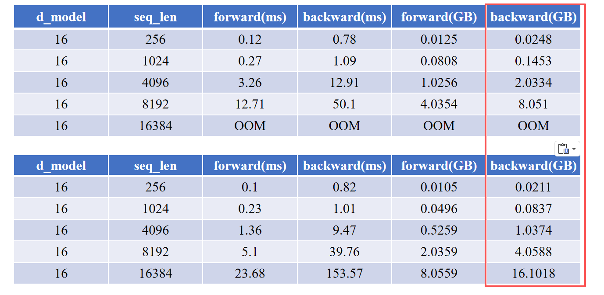
#### 内存减小一半的核心原因：jit能通过内存访问优化、中间结果复用、冗余计算消除来降低显存占用，从而直接避免OOM 让更大规模模型或者更长序列的任务可以正常运行
##### 关于时间上没有区别这一点还可以继续深入思考……比如此时的性能瓶颈不在计算速度？

